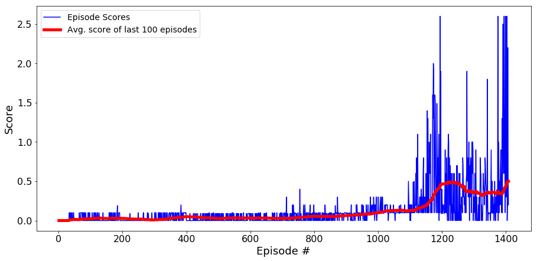

# Udacity project Multi-agent tennis collaboration/competition

* This repository contains the implementation of a Multi-Agent collaboration using Multi-Agent Deep Deterministic Policy Gradient (MADDPG).

* This has been part of Udacity's Deep Reinforcement Learning Nanodegree program

## Project description

In this environment, two agents control rackets to bounce a ball over a net. If an agent hits the ball over the net, it receives a reward of +0.1. If an agent lets a ball hit the ground or hits the ball out of bounds, it receives a reward of -0.01. Thus, the goal of each agent is to keep the ball in play.

The observation space consists of 8 variables corresponding to the position and velocity of the ball and racket. Each agent receives its own, local observation. Two continuous actions are available, corresponding to movement toward (or away from) the net, and jumping.

The task is episodic, and in order to solve the environment, your agents must get an average score of +0.5 (over 100 consecutive episodes, after taking the maximum over both agents). Specifically,

After each episode, we add up the rewards that each agent received (without discounting), to get a score for each agent. This yields 2 (potentially different) scores. We then take the maximum of these 2 scores.
This yields a single score for each episode.
The environment is considered solved, when the average (over 100 episodes) of those scores is at least +0.5.

## Solution

This project has been solved on a Jupyter notebook. It took 1555 episdoes to achieve the desired average reward. (+0.5)

Follow the instructions in `Tennis_MADDPG.ipynb` to get started with training your own agent!  

See `Report.ipynb` for analysis of input hyperparameters (learning rates, etc) and output.

#### Results (rewards):

### Requirements
#### Libraries:
* pip install unityagents
* pip install numpy
* pip install matplotlib
* install pytorch following the instructions on the pytorch website: https://pytorch.org/get-started/locally/

##### You will need the folder named: Tennis_Windows_x86_64 and the jupyter notebook named Tennis_MADDPG.ipynb

* For this project you might not need to install Unity3D. This is because the files for the environment were provided by the Udacity Nano degree in Deep reinforcement learning.
* Make sure to uncompressed the file 'Tennis_Windows_x86_64.zip'

#### For mac
Use 'Tennis.app.zip' instead of 'Tennis_Windows_x86_64.zip'

#### For Linux
Use 'Tennis_Linux.zip' instead of 'Tennis_Windows_x86_64.zip'
